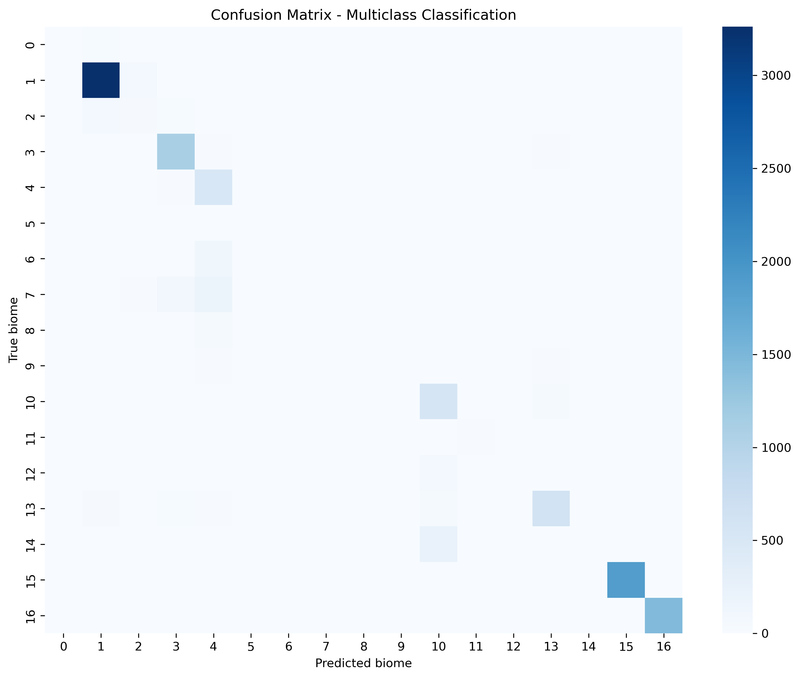
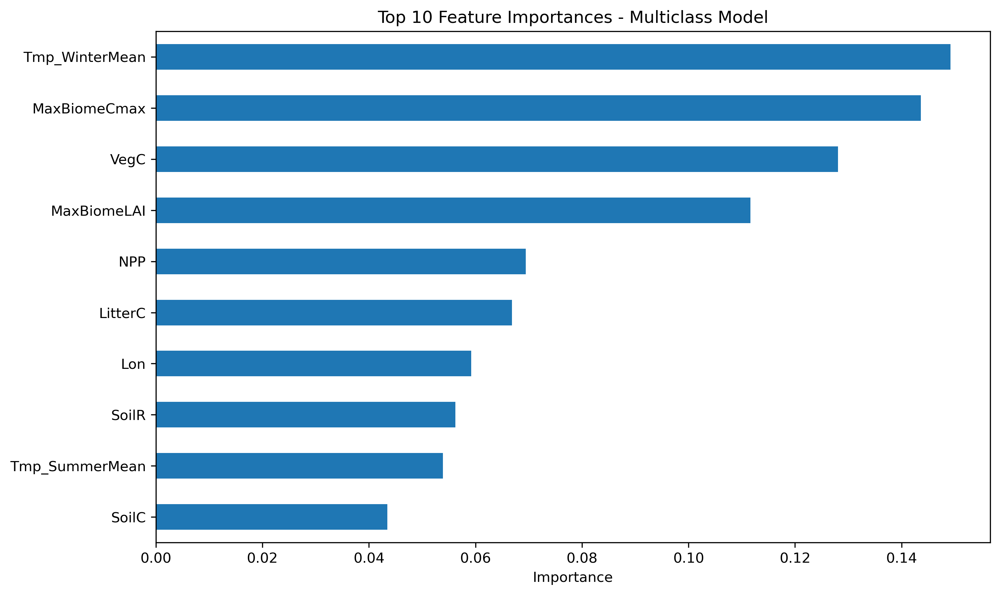
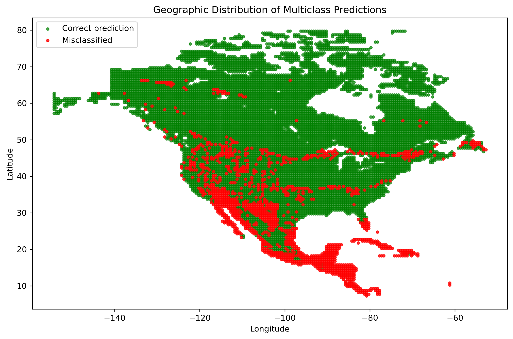
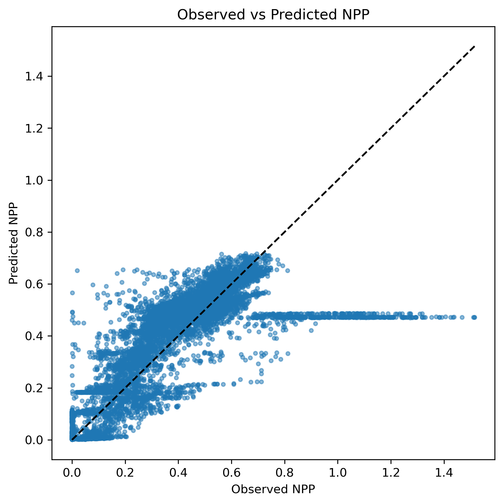
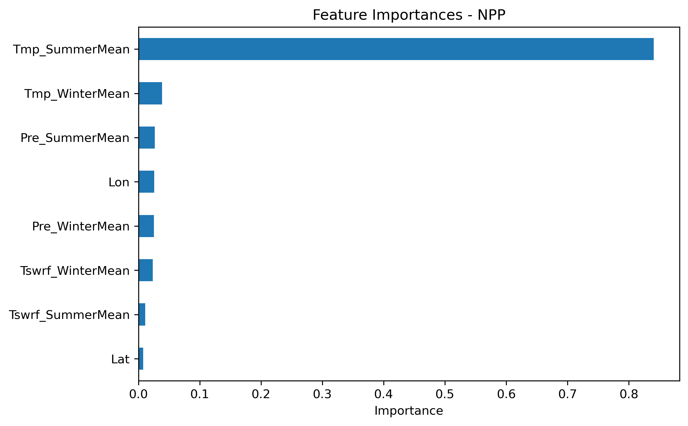
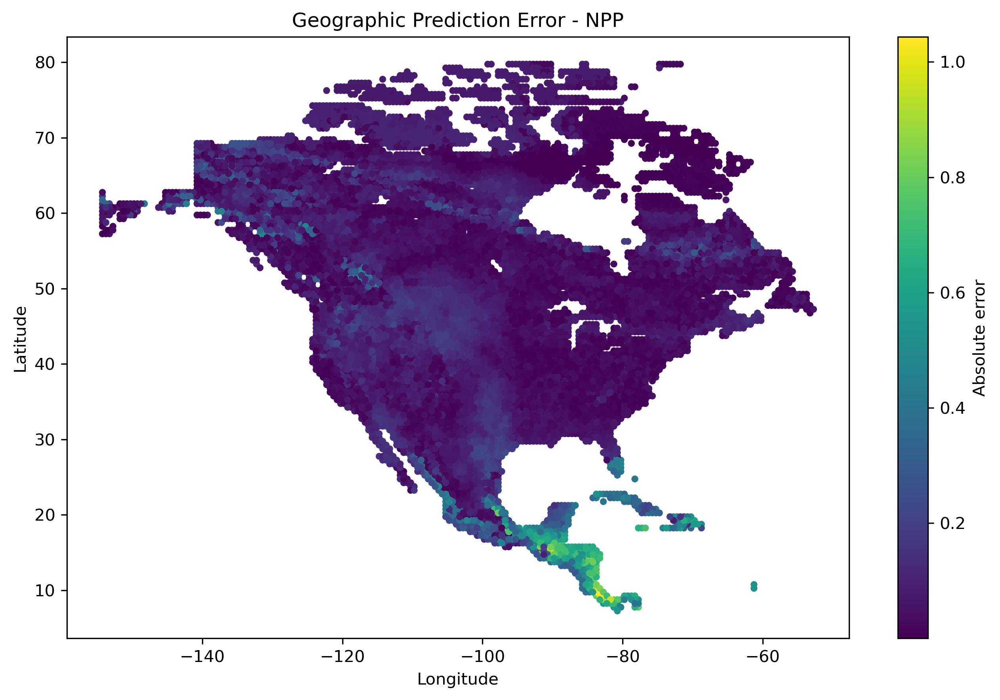
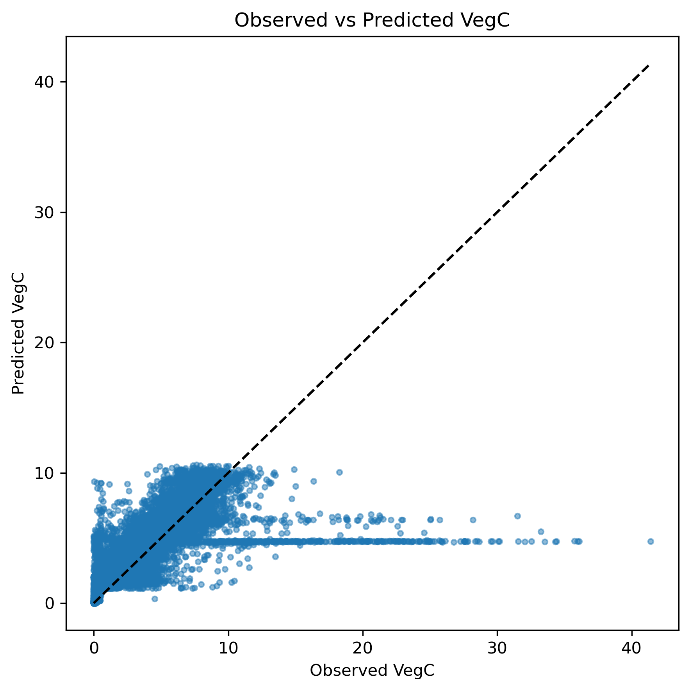
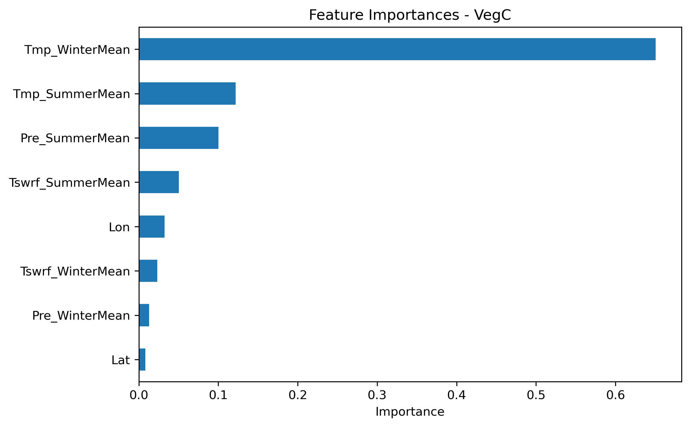
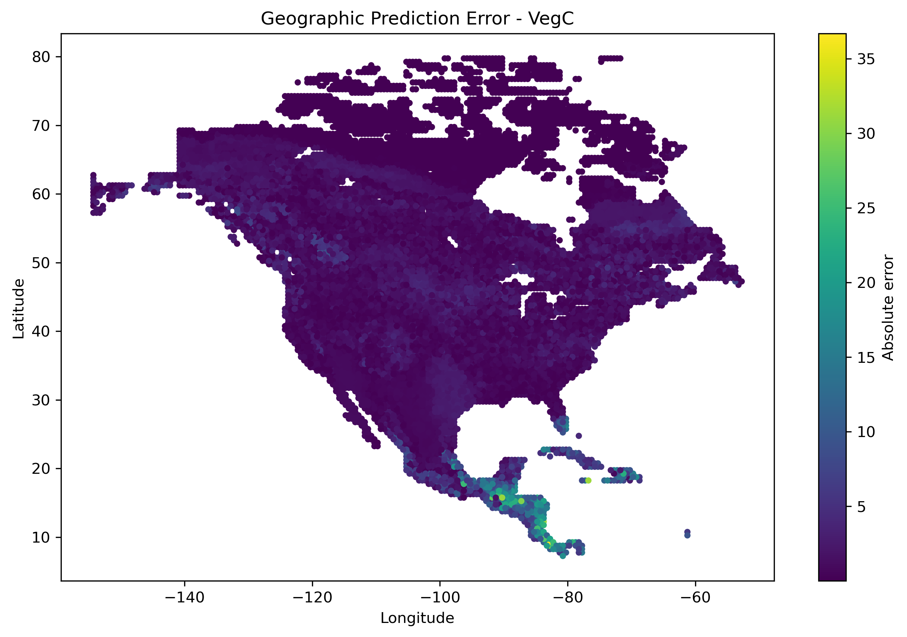

# Random Forest Modelling of Global Biomes

This project applies Random Forest models to predict global biome classes and carbon-related variables using climate, geographic, and LPJ-GUESS-derived features. The model is trained on European data and evaluated on North America to assess its ability to generalize across regions.

## Overview

Global biome distribution is influenced by climate, geography, and vegetation dynamics.

This project studies:
- Binary classification of biome presence
- Multiclass biome classification
- Cross-region generalization (Europe → North America)
- Feature importance of environmental variables
- Regression for carbon variables (NPP, VegC)

---

## Project Structure

```
biome-random-forest/
├── main.py
├── src/
│   ├── data_loader.py
│   ├── visualization.py
│   ├── classification.py
│   └── regression.py
├── data/
├── figures/
├── results/
├── requirements.txt
└── README.md
```

---

## 📄 File Description

**main.py**  

Entry point. Runs the full pipeline.

**data_loader.py**  

Loads and merges biome, climate, and geographic data.

**visualization.py**  

Generates and saves plots.

**classification.py**  

Implements binary and multiclass Random Forest classification.

**regression.py**  

Implements Random Forest regression for NPP and VegC.

---

## Requirements

```
pandas
numpy
matplotlib
seaborn
scikit-learn
pycountry_convert
```

Install dependencies:

```
pip install -r requirements.txt
```

---

## Run

```
python main.py
```

All figures will be saved in the `figures/` folder.  
Model performance metrics will be saved in the `results/` folder.

---

## Output

### Classification

- `figures/multiclass_confusion_matrix.png`
- `figures/multiclass_feature_importance.png`
- `figures/multiclass_geographic_errors.png`

### Regression

- `figures/npp_observed_vs_predicted.png`
- `figures/vegc_observed_vs_predicted.png`

### Metrics

- `results/model_metrics.txt`

---

## Data

The dataset is based on outputs from the LPJ-GUESS dynamic vegetation model, combined with climate statistics (temperature, precipitation, and radiation) and geographic information.

All data are provided as part of the course materials.

---

## Method

Model:

Random Forest

Classification:

1. Train on European data  
2. Predict biome classes on North America  
3. Evaluate using accuracy and confusion matrix  

Regression:

1. Train on European data  
2. Predict continuous variables (NPP, VegC)  
3. Evaluate using MSE, RMSE, MAE, and R²  

Feature importance:

Computed from trained Random Forest models to identify key predictors

---

## Results Analysis

### Binary Classification


The binary classification works well overall, with most points predicted correctly.

The mistakes mainly appear in northern areas and regions where biomes are mixed. These are harder to classify because the boundaries are not very clear.

---

### Multiclass Classification



From the confusion matrix, we can see that the main biome classes are predicted quite well.

However, some classes are confused with each other, especially when they are similar or less common in the data.

---

### Feature Importance (Multiclass)



Temperature variables, especially winter temperature, have the biggest impact on the predictions.

Some vegetation-related variables like VegC and NPP also play an important role.

---

### Geographic Prediction Performance



Most of North America is predicted correctly.

Errors are more common in the south (for example Mexico) and in transition regions. This suggests that the model trained on Europe does not fully adapt to different climates.

---

### Regression – NPP



The model captures the general trend of NPP reasonably well.

But for larger values, the predictions tend to level off, meaning high values are underestimated.

---

### Feature Importance – NPP



Summer temperature is clearly the most important factor for predicting NPP.

Other variables have much smaller contributions.

---

### Geographic Error – NPP



Errors are relatively small in most regions.

However, they become larger in tropical areas, where the climate is quite different from the training data.

---

### Regression – VegC



VegC is harder to predict than NPP.

The results are more scattered, and the model tends to underestimate higher values.

---

### Feature Importance – VegC



Winter temperature is the most important feature here.

Summer temperature and precipitation also contribute, but less strongly.

---

### Geographic Error – VegC



Errors are larger in southern regions, especially Mexico and Central America.

This again shows that the model does not transfer perfectly from Europe to different environments.

---

## Author

Yiwen Yang
